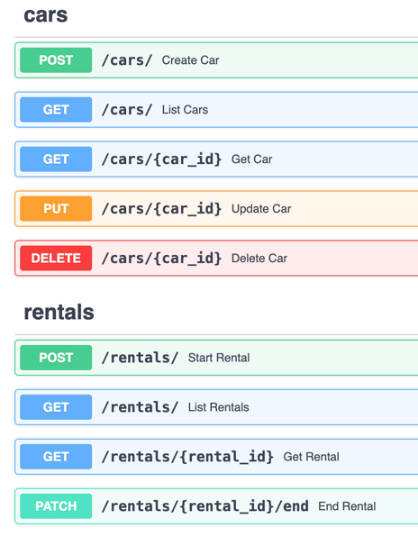
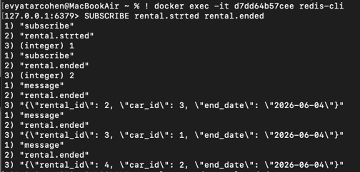

# DriveNow

A car rental management REST API built with FastAPI and SQLAlchemy.

## Architecture

The codebase is organized into distinct layers. Each layer has a single responsibility and communicates only with the layer directly below it.

```
HTTP Request
     │
     ▼
┌─────────────┐
│  API Layer  │  api/routes/
└──────┬──────┘
       │
       ▼
┌─────────────────┐
│  Service Layer  │  services/
└────────┬────────┘
         │
         ▼
┌──────────────────────┐
│  Repository Layer    │  repositories/
└──────────┬───────────┘
           │
           ▼
┌──────────────────────┐
│      Database        │
└──────────────────────┘
```

### Layers

**API** (`api/routes/`)
Receives HTTP requests, validates input via Pydantic schemas, delegates to the service layer. No business logic, no DB access.

**Service** (`services/`)
Contains all business logic. Validates rules, handles status transitions, orchestrates operations. Talks only to the repository interface, never to the DB directly.

**Repository** (`repositories/`)
The only layer that touches the DB. Abstracts all data access behind a clean interface. The service doesn't know or care if it's SQLite, PostgreSQL, or MongoDB.

**Models** (`models/`)
SQLAlchemy ORM definitions. Represent the DB tables as Python classes.

**Schemas** (`schemas/`)
Pydantic models. Define the shape of data coming in from requests and going out in responses.

**Core** (`core/`)
Infrastructure setup — DB engine, session, config, logging. Used by all layers but belongs to none.

## Stack

- [FastAPI](https://fastapi.tiangolo.com/) — web framework
- [SQLAlchemy](https://www.sqlalchemy.org/) — ORM
- [Pydantic](https://docs.pydantic.dev/) — data validation
- [SQLite](https://www.sqlite.org/) — database. Zero-config and easy to bootstrap, which fits the scope of this project. In a production system this should be replaced with PostgreSQL or MySQL.
- [Redis](https://redis.io/) — message broker for rental events
- [Prometheus](https://prometheus.io/) — metrics collection

## Running with Docker

```bash
docker-compose up --build
```

This starts the app and a Redis instance. The API will be available at `http://localhost:8000` and the interactive docs at `http://localhost:8000/docs`.

To override configuration, create a `.env` file based on `.env.example` before running. Environment variables in `.env` take priority over the defaults.

## API Usage

Interactive docs are available at `http://localhost:8000/docs` once the app is running.

### Cars

```bash
# Add a car
curl -X POST http://localhost:8000/cars/ \
  -H "Content-Type: application/json" \
  -d '{"model": "Toyota Camry", "year": 2022}'

# List all cars
curl http://localhost:8000/cars/

# List available cars only
curl http://localhost:8000/cars/?status=available

# Get a specific car
curl http://localhost:8000/cars/1

# Update a car
curl -X PUT http://localhost:8000/cars/1 \
  -H "Content-Type: application/json" \
  -d '{"status": "maintenance"}'

# Delete a car
curl -X DELETE http://localhost:8000/cars/1
```

### Rentals

```bash
# Start a rental
curl -X POST http://localhost:8000/rentals/ \
  -H "Content-Type: application/json" \
  -d '{"car_id": 1, "customer_name": "John Doe"}'

# List all rentals
curl http://localhost:8000/rentals/

# List rentals for a specific car
curl http://localhost:8000/rentals/?car_id=1

# Get a specific rental
curl http://localhost:8000/rentals/1

# End a rental
curl -X PATCH http://localhost:8000/rentals/1/end
```

### Metrics

```bash
curl http://localhost:8000/metrics
```
ex: """drivenow_request_duration_seconds_created{method="GET",path="/cars/"} 1.7805847390847685e+09"""

## Messaging

Rental events are published to Redis Pub/Sub after successful DB operations. Only two events are published — `rental.started` and `rental.ended` — because these represent the core business transitions that external services (billing, notifications, analytics) are likely to care about. Car management operations are internal and have no external consumers.

| Event | Channel | Payload |
|-------|---------|---------|
| Rental started | `rental.started` | `rental_id`, `car_id`, `customer_name`, `start_date` |
| Rental ended | `rental.ended` | `rental_id`, `car_id`, `end_date` |

To listen to events manually:
```bash
redis-cli subscribe rental.started rental.ended
```

example:

